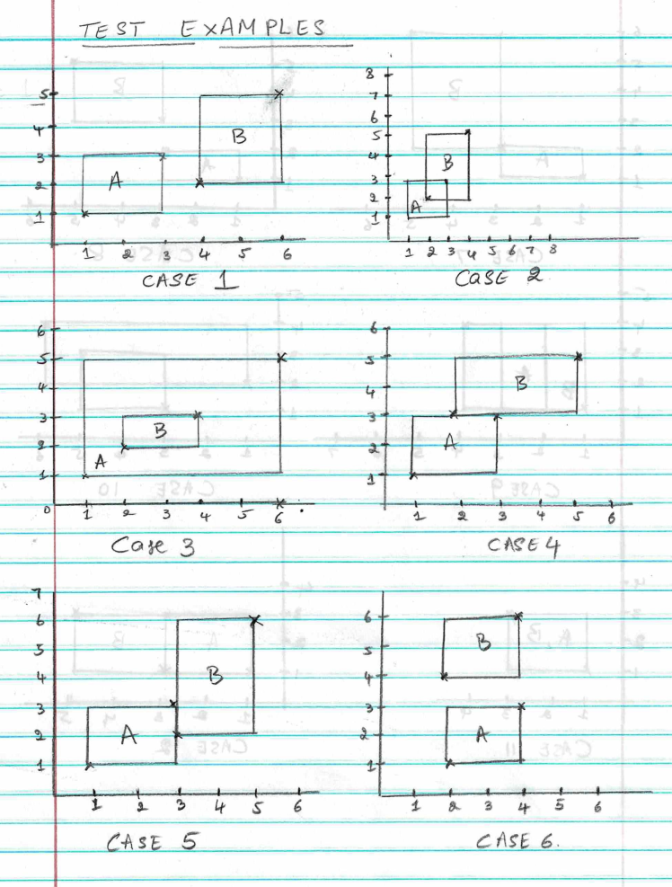
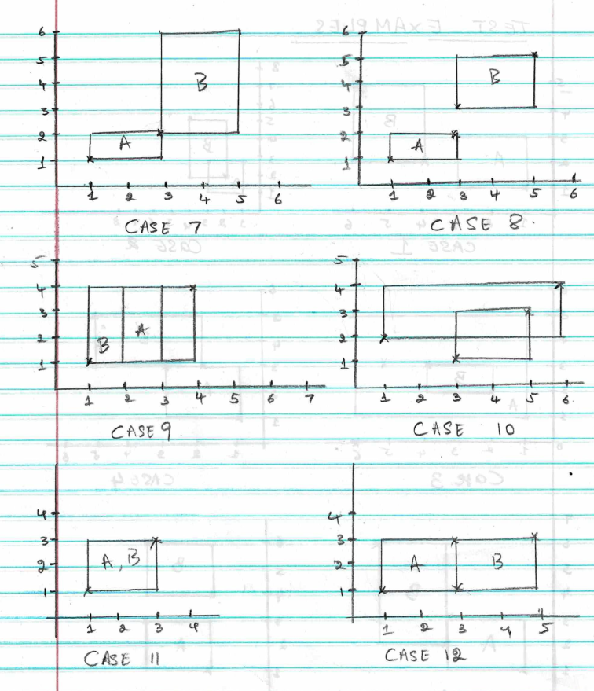

# Rectangles Intersection Checker

This C++ utility checks the relationship between two rectangles on a 2-D plane.

---

## Overview

Given two rectangles **A** and **B** defined by their bottom-left and top-right coordinates, this program classifies their relationship into one of the following categories:

- No intersection
- Intersection (partial overlap)
- Containment (one rectangle fully inside the other)
- Adjacency (rectangles share an edge)
- Vertex touch (rectangles meet only at a corner point)

---

## Project Structure

```
- Rectangles_Exercise.docx  # Problem statement
- rectangles.cpp            # Main source file containing Rectangles class and test cases
- README.md                 # This file
```

---

## Requirements

- A C++ compiler (g++ etc.)

---

## Building

```bash
g++ -o rectangles rectangles.cpp
```

---

## Running

```bash
./rectangles
```

Expected output:
```
Case 1: Rectangles don't intersect
-----------------------
Case 2: Rectangles intersect
-----------------------
Case 3: B is inside A
-----------------------
Case 4: Rectangles are adjacent on the X axis
-----------------------
Case 5: Rectangles are adjacent on the Y axis
-----------------------
Case 6: Rectangles don't intersect
-----------------------
Case 7: Rectangles touch on the vertices
-----------------------
Case 8: Rectangles don't intersect
-----------------------
Case 9: A is inside B
-----------------------
Case 10: Rectangles intersect
-----------------------
Case 11: A is inside B
-----------------------
Case 12: Rectangles are adjacent on the Y axis
-----------------------
```

---

## Test Cases

| Case | Description              | Expected Output              |
|------|--------------------------|------------------------------|
| 1    | No overlap               | Rectangles don't intersect   |
| 2    | Partial overlap          | Rectangles intersect         |
| 3    | A contains B             | B is inside A                |
| 4    | Shared horizontal edge   | Adjacent on the X axis       |
| 5    | Shared vertical edge     | Adjacent on the Y axis       |
| 6    | No overlap               | Rectangles don't intersect   |
| 7    | Corner touch only        | Touch on the vertices        |
| 8    | No overlap               | Rectangles don't intersect   |
| 9    | B contains A             | A is inside B                |
| 10   | Partial overlap          | Rectangles intersect         |
| 11   | B contains A             | A is inside B                |
| 12   | Shared vertical edge     | Adjacent on the Y axis       |






---
